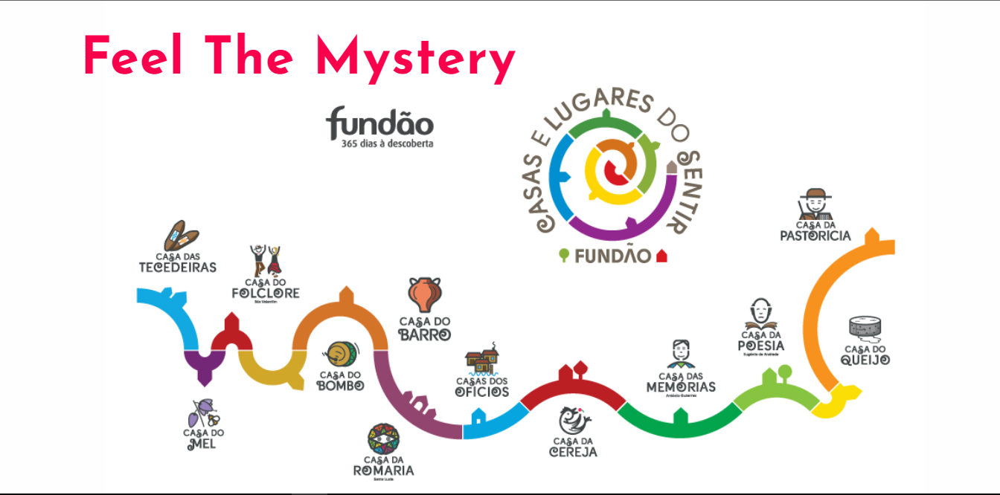

# Feel The Mystery

 

## 💻 About

This game is for children to be able to know the houses of feeling in an educational and fun way. 
This game has audio at the end, please put a sound, thanks.

## 🧠 Technologies

    
    

 

---

<table>
  <tr>
    <td>
      
    </td>
    <td>
      Made by <a href="https://github.com/asolipa0">António Solipa.</a> 🙋‍♂️
    </td>
  </tr>
</table>

<table>
  <tr>
    <td>
      
    </td>
    <td>
      Made by <a href="https://github.com/Biancarei2007">Bianca Rei.</a> 🙋‍♂️
    </td>
  </tr>
</table>