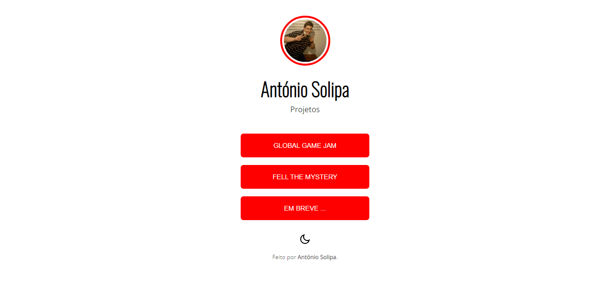

# Página de links dos Projetos - António Solipa

 

> 🚀 <a href="#">Acesse aqui</a>

## 💻 Sobre

Página de links, na propósta de ser usada para cosulta de projetos, feita para dilvulgar os projetos realizados pelo aluno <a href="https://github.com/asolipa1">António Solipa</a>, atraves do conteudo apredido na Escola Profisional do Fundão.

## 🧠 Tecnologias

    
    
    

 

---

<table>
  <tr>
    <td>
      
    </td>
    <td>
      Feito por <a href="https://github.com/asolipa0">António Solipa.</a> 🙋‍♂️
    </td>
  </tr>
</table>
